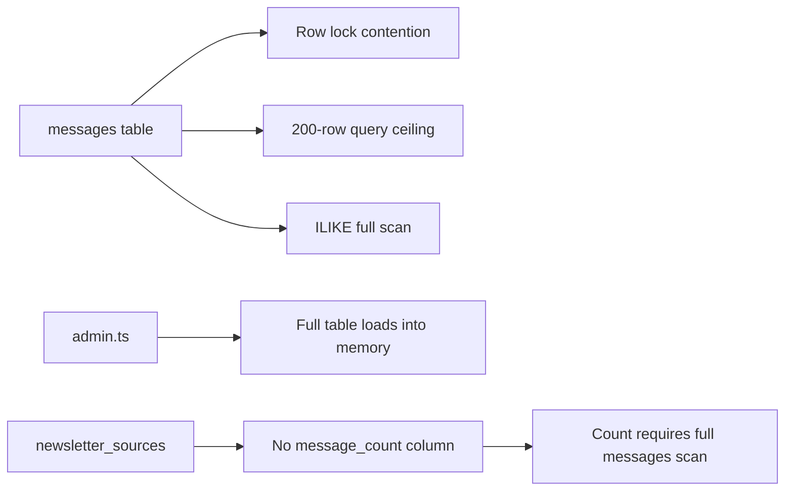

# Lumen — Architectural Review

> **Reviewer Role:** Senior Data Architect, Backend Systems Reviewer, Product Design Analyst  
> **Date:** 2026-04-11  
> **Scope:** Product spec, database schema, data access layer, sync pipeline, API surface  
> **Codebase:** `PRODUCT_SPEC.md`, `supabase/schema.sql`, `src/lib/data.ts`, `src/lib/gmail.ts`, `src/lib/content.ts`, `src/lib/crypto.ts`, `src/lib/admin.ts`, `src/lib/types.ts`, API routes

---

## 1. Executive Assessment

### Overall Verdict

**Solid V1 architecture with several design strengths, but carrying 3–4 structural decisions that will become painful before reaching even moderate scale (1,000+ users, 50K+ messages).** The schema is thoughtfully designed for single-user simplicity and maps well to the current product flows. However, it overloads the `messages` table, has a semantic modeling contradiction in the reading state machine, and lacks operational infrastructure that a production system needs.

### Production Readiness: Conditional Yes

The app is deployable today for a small user base (<100 users). Before scaling beyond that, the items in "Must Fix Now" must be addressed.

### Top Strengths

| # | Strength |
|---|---|
| 1 | **Clean separation of message metadata vs. body content** — `message_bodies` is a first-class design choice. Enables content pruning without metadata loss. |
| 2 | **RLS-first security model** — Row Level Security on every table provides defense-in-depth. Even a compromised API route cannot leak cross-user data. |
| 3 | **Thoughtful sync pipeline** — Incremental sync via Gmail `historyId` with automatic fallback to full-query is well-designed. Token refresh capture is production-grade. |
| 4 | **Idempotent message upserts** — `ON CONFLICT provider_message_id` prevents duplicate imports. Race condition handling (`23505`) on source inserts is correct. |
| 5 | **Retention-aware design** — Two-pass pruning (body → metadata) with exemptions for saved/archived is a mature pattern that balances storage costs with user expectations. |
| 6 | **Encrypted tokens at rest** — AES-256-GCM with random IV per encryption operation is strong. No plaintext secrets in the database. |

### Top Risks

| # | Risk | Severity |
|---|---|---|
| 1 | **`state` enum includes `saved` and `archived` but these are also independent booleans** — a message can be `state='new'` + `saved=true`. The enum values `saved` and `archived` are effectively dead code in the state column, creating confusion and bugs. | 🔴 High |
| 2 | **Reading state merged into `messages` table** — conflates imported email data (immutable) with per-user interaction data (highly mutable). Causes lock contention during sync and state updates on the same rows. | 🔴 High |
| 3 | **Home page fetches 200 messages and filters in application code** — does not use dedicated DB queries per section. Sections may be silently incomplete. | 🟡 Medium |
| 4 | **Admin dashboard loads ALL messages/sources/rules into memory** — no SQL aggregation. Crashes at ~10K messages. | 🟡 Medium |
| 5 | **`sender_rules` and `newsletter_sources` are not formally linked** — relationship is inferred via email/domain string matching at runtime. Fragile, slow, and blocks referential integrity. | 🟡 Medium |
| 6 | **Search uses `ILIKE` instead of the existing GIN indexes** — full table scan on every query. | 🟡 Medium |
| 7 | **`message_bodies.user_id` nullable + backfill migration** — RLS fallback to admin client in `getLiveMessageById()`. Workaround indicates a schema debt. | 🟡 Medium |
| 8 | **No `messages_count` column on `sync_jobs`** — no way to audit how many messages a sync run processed or skipped. | 🟠 Low-Medium |

---

## 2. Flow-to-Schema Mapping Review

### 2.1 Gmail OAuth Connection

**Flow:** User → Google consent → callback → exchange code → store encrypted tokens in `email_accounts`

**Schema mapping:** ✅ **Clean**

- `email_accounts` has all necessary fields: encrypted tokens, expiry, provider info, email address.
- `UNIQUE(user_id, provider)` correctly enforces one Gmail account per user.
- Upsert on `user_id, provider` handles re-connection cleanly.

**Issue:** The `provider_account_id` stores the Gmail email address, and `email_address` also stores it. This is a mild redundancy — `provider_account_id` is the canonical identifier and `email_address` is the display value. Acceptable, but should be documented.

---

### 2.2 Sync Lifecycle

**Flow:** User triggers sync → load rules → backfill new rules → incremental sync existing rules → upsert sources + messages → prune old bodies → update account state

**Schema mapping:** ✅ **Mostly clean, with gaps**

| Aspect | Status | Notes |
|---|---|---|
| Sync job tracking | ⚠️ Partial | `sync_jobs` records job-level audit, but **does not record message count, skipped count, or per-rule results**. The `cursor` field exists but is never used. |
| Rate limiting | ✅ | Uses `email_accounts.last_synced_at` — simple and effective. |
| Token refresh persistence | ✅ | Refreshed tokens are captured and re-encrypted after sync. |
| New rule backfill | ✅ | `synced_at IS NULL` on `sender_rules` correctly identifies unsynced rules. |
| History ID lifecycle | ✅ | Stored on `email_accounts`, updated per sync, with fallback on expiry. |

**Gap 1:** `sync_jobs.status` has a CHECK constraint with values `('pending', 'running', 'done', 'failed')`, but the code writes `'completed'` (line 1226 of data.ts). This is a **bug** — the upsert will silently fail. The schema says `'done'` but the code says `'completed'`.

> [!CAUTION]
> `sync_jobs.status = 'completed'` will be rejected by the CHECK constraint `check (status in ('pending', 'running', 'done', 'failed'))`. This means successful sync jobs are never marked as finished in the audit log.

**Gap 2:** There's no link from `sync_jobs` to the messages it created. If a sync run imports 50 messages, there is no way to trace which messages came from which sync job. This makes debugging and recovery very difficult.

---

### 2.3 Newsletter Detection

**Flow:** Email arrives → check sender rules → check headers → decide include/exclude → store `detection_method` on message

**Schema mapping:** ✅ **Clean**

- `detection_method` column captures the provenance of each classification decision.
- `sender_rules` correctly models the rule types and actions.
- The `newsletter_sources.include_rule` / `exclude_rule` booleans mirror the rule action. The CHECK constraint `NOT (include_rule AND exclude_rule)` prevents contradictions.

**Concern:** The `include_rule` and `exclude_rule` on `newsletter_sources` are derived/denormalized from `sender_rules`, but there is **no FK or trigger** keeping them in sync. If a `sender_rule` is deleted, the `newsletter_sources` flags are stale until a sync re-evaluates them. This is a **hidden coupling risk**.

---

### 2.4 Home Page

**Flow:** Fetch 200 most recent messages → filter in-app into sections

**Schema mapping:** ⚠️ **Problematic**

The home page spec defines 5 sections:
- New arrivals (state = 'new')
- Continue reading (state = 'opened' or 'in_progress')
- Recently read (state = 'finished')
- Saved for later (saved = true)
- Source sample strip

All derived from a single `getLiveMessages()` call limited to 200 rows.

| Problem | Impact |
|---|---|
| If a user has 300 new messages, only 200 are fetched. The "new arrivals" count is capped, and the "total new" stat on the page is wrong. | User sees inaccurate counts. |
| "Recently read" (finished) messages may not appear if they're older than 200th most recent message. | Section appears empty even though finished articles exist. |
| "Saved" messages older than the 200th message are invisible on the home page. | Users think saved articles disappeared. |

**Recommendation:** Use dedicated per-section queries:
```sql
-- New arrivals
SELECT ... FROM messages WHERE state = 'new' ORDER BY received_at DESC LIMIT 6;

-- Continue reading
SELECT ... FROM messages WHERE state IN ('opened', 'in_progress') ORDER BY last_read_at DESC LIMIT 6;

-- Recently read
SELECT ... FROM messages WHERE state = 'finished' ORDER BY finished_at DESC LIMIT 4;

-- Saved
SELECT ... FROM messages WHERE saved = true ORDER BY received_at DESC LIMIT 6;
```

---

### 2.5 Library

**Flow:** Paginated list with filter tabs

**Schema mapping:** ⚠️ **Same problem as home**

`getLibraryData()` calls `getLiveMessages()` which is capped at 200 rows. The library is supposed to show ALL messages, paginated at 50 per page. But the underlying query only ever fetches 200, meaning:

- A user with 300 messages can never see messages 201–300 in the library.
- The `?page=N` parameter in the URL is cosmetic — pagination is done on the 200-item in-memory array.

The spec says "All synced messages, paginated (50 per page)" but the implementation caps at 200.

---

### 2.6 Reader Page + State Updates

**Flow:** Open message → state = 'opened' → scroll → 'in_progress' → 95% → 'finished'

**Schema mapping:** ⚠️ **Functional but flawed**

**Bug in `updateMessageState()`** ([data.ts:678-699](file:///Users/davinci/Desktop/Presidio/Personal%20Reader/personal-reader/src/lib/data.ts#L678-L699)):

```typescript
if (payload.state === "opened" || payload.state === "in_progress") {
  update.opened_at = now; // ← Always overwrites. Spec says "set on first open, never overwritten"
}
```

The spec says `opened_at` should be set on first open and **never overwritten**. The code overwrites it on every scroll event (since scroll triggers `state = 'in_progress'`). Fix: use a conditional update:

```sql
UPDATE messages SET opened_at = COALESCE(opened_at, NOW()) WHERE ...
```

**Bug 2:** `finished_at` is set to `null` when `state !== 'finished'` (line 686). This means if a user re-opens a finished article and scrolls partially, their `finished_at` is lost. The spec doesn't say to clear `finished_at` on re-reading.

---

### 2.7 Search

**Flow:** User types query → `ILIKE` search across subject, from_email, from_name, snippet

**Schema mapping:** ⚠️ **Underperforming**

- GIN full-text indexes exist on `messages` and `message_bodies` but are **never used**.
- `ILIKE %query%` cannot use any index — it's a full sequential scan.
- Body text (the largest text field) is not searched at all.
- Results are limited to 50 with no pagination.

**At 50K messages, this query will take seconds.** The indexes were created with intent but never wired in.

---

### 2.8 Sources View

**Flow:** List all sources grouped by label, with pending rules section

**Schema mapping:** ✅ **Adequate with coupling concern**

- Source grouping works via string matching between `sender_rules.value` and `newsletter_sources.normalized_sender_email` / `normalized_sender_domain`.
- This is done in application code via `ruleMap` lookup.
- No FK joins the two tables.

**Fragility:** If a user changes their Gmail account and re-syncs, the `from_email` might differ slightly (e.g., case variation, alias), breaking the string match between `sender_rules.value` and `newsletter_sources.normalized_sender_email`.

---

### 2.9 Saved Messages

**Flow:** Filter `saved = true`, exempt from pruning

**Schema mapping:** ✅ **Clean**

- Partial index `idx_messages_user_saved` covers this query efficiently.
- Pruning correctly skips `saved = true` rows.
- Same 200-message ceiling applies when accessed from home page, but `/saved` page has a direct path.

**Note:** `getSavedData()` also calls `getLiveMessages()` (200-cap), so saved messages older than the 200th message are invisible. Needs its own dedicated query.

---

### 2.10 Settings + Rule Management

**Flow:** Add/edit/delete rules, sync per-rule, delete data, disconnect Gmail

**Schema mapping:** ✅ **Mostly clean**

- Rule deletion cascades: rule → source → messages (via FK on source → messages). This is correct.
- `deleteUserData()` deletes in the right order (bodies → messages → sources → rules → sync_jobs), but could use a transaction.

**Risk:** `deleteUserData()` runs 5 sequential deletes without a transaction. If the process crashes after deleting messages but before deleting sources, the user has orphaned sources. Use a Postgres function or Supabase RPC to ensure atomicity.

---

### 2.11 Admin Dashboard

**Flow:** Load all users + all messages + all rules + all accounts + all sources → aggregate in app code

**Schema mapping:** 🔴 **Not scalable**

The admin module (`admin.ts`) fetches entire tables into memory:
- `.from("messages").select("user_id, received_at")` — loads **all message rows across all users**
- `.from("messages").select("state")` — loads **all rows again** just for state counts
- `auth.admin.listUsers({ perPage: 1000 })` — hard limit

At 100 users × 500 messages each = 50,000 rows loaded into Node.js memory. At 1,000 users this crashes.

**Recommendation:** Replace with SQL aggregation:
```sql
SELECT user_id, COUNT(*) as message_count FROM messages GROUP BY user_id;
SELECT state, COUNT(*) FROM messages GROUP BY state;
SELECT DATE(received_at), COUNT(*) FROM messages WHERE received_at > NOW() - INTERVAL '30 days' GROUP BY 1;
```

---

## 3. Schema Quality Review

### 3.1 `lumen.email_accounts`

**Purpose:** Store Gmail OAuth connection per user.

| Aspect | Assessment |
|---|---|
| **Design** | ✅ Well-structured. Clean FK to `auth.users`, proper encryption fields. |
| **Uniqueness** | ✅ `(user_id, provider)` + `(user_id, provider_account_id)` — covers both single-provider and re-connection cases. |
| **Missing** | ⚠️ No `scopes_granted` column — if OAuth scopes change, no way to know what permissions exist. |
| **Missing** | ⚠️ No `connected_at` timestamp — `created_at` serves this purpose but is ambiguous after re-connection (upsert). |
| **Risk** | If `APP_ENCRYPTION_KEY` is rotated, all existing tokens become undecryptable. No key rotation support. |

---

### 3.2 `lumen.newsletter_sources`

**Purpose:** One row per publisher per user. Auto-created during sync.

| Aspect | Assessment |
|---|---|
| **Design** | ✅ Good entity boundary. Sources are user-scoped. |
| **`include_rule` / `exclude_rule` booleans** | ⚠️ Denormalized from `sender_rules`. Not kept in sync. No FK. |
| **`priority_level`** | ✅ CHECK constraint on valid values. Defaults to 'normal'. |
| **`logo_url`** | ✅ Nullable, only overwritten if empty. |
| **Missing** | ⚠️ No `message_count` column. Count is computed by filtering all messages — expensive at scale. |
| **Missing** | ⚠️ No FK to `sender_rules`. Relationship is inferred by string matching. |
| **Missing** | `description` and `category` are never populated. Consider removing or populating from detection. |

---

### 3.3 `lumen.messages`

**Purpose:** One row per newsletter issue. Contains both email metadata AND reading state.

| Aspect | Assessment |
|---|---|
| **Overloaded** | 🔴 This table mixes immutable email metadata (subject, from, headers, received_at) with highly mutable user state (state, progress, saved, archived, scroll position). Every scroll event updates this row. During sync, this row is also upserted. |
| **State column contradiction** | 🔴 `state` enum includes `'saved'` and `'archived'`, but these are separately modeled as booleans. The spec says they're independent: "saved = true, state unchanged." So `state='saved'` is never set — it's a phantom value. |
| **`provider_message_id` uniqueness** | ⚠️ `UNIQUE(provider_message_id)` is **global, not user-scoped**. If two users receive the same forwarded email with the same Gmail message ID (unlikely but possible in shared inboxes), this constraint blocks the second insert. Should be `UNIQUE(user_id, provider_message_id)`. |
| **`raw_headers_json`** | ⚠️ Stores all headers as JSONB. Useful for debugging but adds 1–5KB per row. No retention policy for this field. |
| **Missing** | No `sync_job_id` FK — cannot trace which sync run imported a message. |
| **Missing** | No `word_count` or `estimated_read_minutes` — computed at query time from body text. Should be stored. |
| **Index coverage** | ✅ Good. Indexes cover user+received_at, user+source+received_at, user+state, partial indexes on saved/archived. |

> [!WARNING]
> The `state` column CHECK constraint allows `'saved'` and `'archived'` as valid values, but the application logic treats these as boolean flags, not state values. Code in `getHomeData()` filters `m.saved || m.state === 'saved'` — revealing that both modeling patterns coexist. This will cause categorization bugs if a message's `state` is ever set to `'saved'` (which the spec says should not happen).

---

### 3.4 `lumen.message_bodies`

**Purpose:** Full email content, stored separately for independent pruning.

| Aspect | Assessment |
|---|---|
| **Design** | ✅ Excellent separation. Content pruning nulls these columns without touching message metadata. |
| **`user_id` nullable** | ⚠️ Added via migration, nullable. Causes RLS issues — the code falls back to admin client when user_id is NULL. Should be backfilled and made NOT NULL. |
| **`html_content` vs `sanitized_html_content`** | ⚠️ Both are stored. `html_content` is the raw Gmail HTML. `sanitized_html_content` is the processed version. During re-sync, `html_content` is set to the **sanitized** content (line 932 in data.ts: `html_content: message.sanitizedHtmlContent`). This means the "raw" column isn't raw — it's polluted. |
| **Missing** | No `content_hash` for deduplication. If the same newsletter is re-imported, the full body is stored again. |
| **Missing** | No `pruned_at` timestamp — cannot audit when body content was pruned. |

---

### 3.5 `lumen.sender_rules`

**Purpose:** User-defined include/exclude filters for newsletter detection.

| Aspect | Assessment |
|---|---|
| **Design** | ✅ Clean rule model. `rule_type` + `value` + `action` cover the needed use cases. |
| **`synced_at`** | ✅ Smart dual purpose — NULL means "needs backfill", non-null means "future sync is incremental." |
| **`active`** | ✅ Soft-disable without deletion. |
| **Missing** | No FK to `newsletter_sources`. The rule-to-source relationship is inferred by matching `value` against `normalized_sender_email`/`normalized_sender_domain`. This breaks if values diverge. |
| **Missing** | No `created_by` or provenance field. Currently all rules are user-created, but if auto-detection rules are added, there's no way to distinguish. |

---

### 3.6 `lumen.sync_jobs`

**Purpose:** Audit log for sync runs.

| Aspect | Assessment |
|---|---|
| **Design** | ⚠️ Minimal. Records start/finish/status but not results. |
| **Missing** | No `messages_processed`, `messages_skipped`, `messages_inserted` counters. |
| **Missing** | No `sync_mode` field ('incremental' vs 'full' vs 'backfill'). The `sync_type` field records the trigger ('manual', 'backfill', 'scheduled') but not the mechanism used. |
| **Missing** | No link to the rules that were synced. If a sync runs for 3 rules, there's no per-rule result. |
| **Bug** | Code writes `status = 'completed'` but CHECK constraint only allows `'done'`. |
| **`cursor`** | Never used. Dead column. |

---

### 3.7 `lumen.profiles`

**Purpose:** User role for admin access control.

| Aspect | Assessment |
|---|---|
| **Design** | ✅ Minimal and appropriate. FK to `auth.users` with cascade delete. |
| **RLS** | ✅ Select-only policy — users can see but not modify their own role. |
| **Missing** | No `updated_by` — cannot audit who promoted a user to super_admin. Low priority for current scale. |

---

## 4. Scalability Review

### What Will Work Well

| Aspect | Why |
|---|---|
| **RLS-based isolation** | Postgres handles user filtering at the planner level. Adding users doesn't slow individual user queries. |
| **Partial indexes** (`saved=true`, `archived=true`) | Surgical index coverage for hot queries. Very efficient. |
| **Message body separation** | Pruning strategy keeps the main `messages` table lean. |
| **Incremental sync** | After initial backfill, sync only fetches new messages. Keeps Gmail API quota low. |
| **Upsert-based imports** | No duplicate rows. Safe to re-run. |

### What May Break or Become Slow

| Concern | Threshold | Impact |
|---|---|---|
| **Home page 200-message fetch** | >200 messages per user | Sections show incomplete data. Users with large archives see gaps. |
| **Search via ILIKE** | >10K messages per user | Full table scan. Response time >1s. |
| **Admin dashboard in-app aggregation** | >100 users, >50K total messages | Node.js OOM or >10s response time. |
| **`messages` table lock contention** | High-frequency scroll events + concurrent sync | Sync `UPSERT` and state `UPDATE` compete for row locks on the same rows. |
| **`raw_headers_json` storage** | >100K messages | JSONB column adds 1–5KB per row but is rarely queried. Consider archiving. |
| **`getSettingsData()` fetching all message source_ids** | >10K messages | `supabase.from("messages").select("source_id").eq("user_id", user.id)` loads every message just to count per-source. |

### Likely Bottlenecks Over Time



---

## 5. Future Feature Readiness

| Feature | Readiness | Analysis |
|---|---|---|
| **Multiple email accounts per user** | 🟡 Partially supported | Schema supports it (`email_accounts` has no unique on `user_id` alone). But `runSync()` queries `.single()` on `email_accounts` — hard-coded for one account. UI also assumes single account. **Schema ready, code not.** |
| **More granular reading progress** | 🟡 Partially supported | `progress_percent` (0–100) and `last_scroll_position` exist. But no per-section progress or reading speed tracking. Adding `reading_sessions` table would be needed. |
| **Tagging / folders / collections** | 🔴 Not supported | No junction table for tags. Would need `lumen.tags` + `lumen.message_tags`. Not blocked by current schema but requires new tables. |
| **Highlights / notes** | 🔴 Not supported | Needs `lumen.highlights` table with text range, color, note text, message FK. Nothing in current schema. |
| **Recommendations** | 🔴 Not supported | No engagement signals beyond reading state. No read-time tracking, no topic classification. Would need analytics infrastructure. |
| **Source mute/unsubscribe preferences** | 🟢 Mostly supported | `priority_level` (core/normal/muted) on sources + `exclude_rule` on sender_rules already model this. Would need UI affordance. |
| **Digest summaries** | 🔴 Not supported | No summary storage, no generation pipeline. Would need `lumen.digests` + LLM integration. |
| **Multi-device sync** | 🟢 Supported | Reading state is server-canonical. `last_scroll_position` enables resume. Only gap: no `last_read_device` or session tracking. |
| **Collaborative/shared spaces** | 🔴 Blocked | `user_id` FK on every table. RLS enforces strict user isolation. Sharing requires new permission model, new tables ($user_shares$), and RLS policy rewrite. |
| **Better analytics** | 🔴 Not supported | No event log (opened_at exists but no event table). No read-time duration. Would need `lumen.events` or `lumen.reading_sessions`. |
| **Reclassification of newsletters** | 🟡 Partial | `detection_method` captures initial classification. No `reclassified_at` or `reclassified_by`. Changing a source from include → exclude requires deleting and re-creating the rule. |
| **Rule evolution** | 🟡 Partial | `active` flag enables soft-disable. But no rule history/versioning. Rule changes are destructive (delete rule = delete all messages). |
| **Non-Gmail providers** | 🟢 Schema ready | `email_accounts.provider` is a text field, not hard-coded to 'gmail'. Would need a new API client per provider, but schema handles it. |
| **Export** | 🟡 Partial | Message metadata is queryable. Body content may be pruned. Export of saved messages would work; export of historical content would not survive retention. |

---

## 6. Reliability and Operational Risk Review

### 6.1 Sync Idempotency

✅ **Strong.** `UPSERT ... ON CONFLICT provider_message_id` ensures re-importing the same Gmail message updates metadata without creating duplicates. Reading state columns are excluded from the upsert conflict set — state is preserved on re-sync.

### 6.2 Duplicate Message Handling

⚠️ **Mostly safe, with edge case.**

| Scenario | Outcome |
|---|---|
| Same Gmail message synced twice | ✅ Handled by `provider_message_id` upsert. |
| Same newsletter forwarded by different users | ✅ Each user has their own row. `UNIQUE(user_id, internet_message_id)` prevents per-user duplicates. |
| Same Gmail message ID across different Gmail accounts (different users) | ⚠️ **Bug.** `provider_message_id` is globally unique (`UNIQUE NOT user-scoped`). If two users somehow have the same Gmail message ID, second insert fails. Edge case but should be `UNIQUE(user_id, provider_message_id)`. |

### 6.3 Partial Sync Failures

⚠️ **Partially resilient.**

- Individual message fetch failures are caught and counted as `skippedCount`.
- The sync continues processing remaining messages after a skip.
- **However:** If the sync crashes mid-batch (e.g., Node.js OOM), already-imported messages are preserved (upserts committed), but `email_accounts.history_id` and `last_synced_at` are not updated. The next sync will re-try the same range, re-importing the same messages. This is **safe** (upserts handle it) but **wasteful**.

**Risk:** No transaction wraps the sync. The final account update (history_id, last_synced_at) is a separate query. If it fails, the sync appears to never have happened.

### 6.4 Race Conditions

| Scenario | Risk |
|---|---|
| Two sync requests running simultaneously | ⚠️ Rate limiter (60s) reduces probability, but if a user has two browser tabs, both could trigger sync. The upserts prevent data corruption, but duplicate Gmail API calls waste quota. |
| Scroll state update during sync | ⚠️ Both modify the same `messages` row. Sync does not touch state columns, but the row-level lock causes one operation to wait. Not corrupt but adds latency. |
| Source upsert race | ✅ Handled. Code catches `23505` (unique violation) and retries with a `SELECT`. |

### 6.5 Recovery and Debugging

| Capability | Assessment |
|---|---|
| **Trace a message to its source** | ✅ `detection_method` + `from_email` + `source_id` FK. |
| **Trace a message to its sync run** | 🔴 **Not possible.** No `sync_job_id` on messages. |
| **Identify why a sync failed** | ⚠️ `sync_jobs.error_message` + `email_accounts.last_error` capture the error text, but no stack trace or context. |
| **Identify duplicate imports** | ✅ `provider_message_id` uniqueness prevents duplicates. `internet_message_id` catches cross-provider duplicates. |
| **Audit token lifecycle** | ⚠️ No `token_refreshed_at` column. Token refresh events are invisible. |
| **Audit content pruning** | 🔴 No `pruned_at` timestamp on `message_bodies`. Cannot audit when or why content disappeared. |

### 6.6 Token/Account Lifecycle

⚠️ **Functional but fragile.**

- Token refresh is captured during sync, but **there is no proactive token refresh**. If a user doesn't sync for weeks, their access token expires. The refresh token may also expire (Google enforces 6-month refresh token expiry for apps in "testing" mode, or if the grant is revoked).
- There is no health check endpoint to verify token validity.
- If the `APP_ENCRYPTION_KEY` is lost or rotated, **all tokens become undecryptable**. No key versioning or rotation strategy exists.

---

## 7. Recommended Improvements

### 🔴 Must Fix Now

#### 7.1 Fix `sync_jobs.status` value mismatch

| | |
|---|---|
| **Problem** | Code writes `'completed'` but CHECK constraint only allows `'done'`. Sync audit is silently broken. |
| **Why it matters** | Sync success is never recorded. The `sync_jobs` audit log always shows `'running'` for successful syncs. |
| **Fix** | Change [data.ts line 1226](file:///Users/davinci/Desktop/Presidio/Personal%20Reader/personal-reader/src/lib/data.ts#L1226) from `status: "completed"` to `status: "done"`. |
| **Impact** | 1-line fix. Critical. |

---

#### 7.2 Remove `'saved'` and `'archived'` from the `state` enum

| | |
|---|---|
| **Problem** | The `state` column allows `'saved'` and `'archived'` as values, but the product spec and code treat these as independent booleans (`saved: boolean`, `archived: boolean`). |
| **Why it matters** | Creates semantic confusion. Code like `m.saved || m.state === 'saved'` (line 349, 492) is a defensive patch for a modeling contradiction. New developers will not know which model to use. |
| **Fix** | ALTER the CHECK constraint to remove 'saved' and 'archived': `CHECK (state IN ('new', 'opened', 'in_progress', 'finished'))`. Verify no existing rows have `state='saved'` or `state='archived'` before migrating. |
| **Impact** | Schema migration + code audit. Medium effort, high clarity gain. |

---

#### 7.3 Fix `opened_at` overwrite bug

| | |
|---|---|
| **Problem** | `opened_at` is overwritten on every scroll event, not just first open. |
| **Why it matters** | Analytics ("when was this message first opened?") are corrupted. |
| **Fix** | Change `update.opened_at = now` to use SQL COALESCE or add a conditional: `update.opened_at = undefined` (skip the field on subsequent updates). Or use: `opened_at = COALESCE(opened_at, NOW())` via a raw SQL update. |
| **Impact** | 1-line fix. |

---

#### 7.4 Fix `finished_at` being cleared on re-read

| | |
|---|---|
| **Problem** | When state changes from `'finished'` to `'in_progress'` (user re-reads), `finished_at` is set to `null`. |
| **Why it matters** | Loses the historical "finished" timestamp. |
| **Fix** | Only set `finished_at` when transitioning TO `'finished'`. Never clear it on other transitions. |
| **Impact** | 1-line conditional change. |

---

### 🟡 Should Improve Soon

#### 7.5 Backfill `message_bodies.user_id` and make NOT NULL

| | |
|---|---|
| **Problem** | `user_id` on `message_bodies` is nullable. Code works around this with admin client fallback. |
| **Why it matters** | RLS cannot function correctly on rows without `user_id`. The admin client bypass is a security smell. |
| **Fix** | Run the backfill migration, then `ALTER TABLE lumen.message_bodies ALTER COLUMN user_id SET NOT NULL`. |
| **Impact** | One-time migration + schema change. Removes the admin client workaround in `getLiveMessageById()`. |

---

#### 7.6 Replace home page / library / saved 200-row fetch with dedicated queries

| | |
|---|---|
| **Problem** | All data flows funnel through `getLiveMessages()` which caps at 200 rows. |
| **Why it matters** | Sections silently truncate. Library "pagination" is fake. Users with 300+ messages lose visibility. |
| **Fix** | Write per-section queries for home page. Write a proper paginated query for library using `.range(offset, offset + limit)`. |
| **Impact** | Medium refactor. Each section gets its own query function. Improves accuracy and enables true pagination. |

---

#### 7.7 Use full-text search instead of ILIKE

| | |
|---|---|
| **Problem** | Search does sequential scans despite GIN indexes existing. |
| **Why it matters** | Search response time degrades linearly with message count. |
| **Fix** | Use `to_tsvector` / `to_tsquery` via Supabase's `.textSearch()` or a raw RPC call. The indexes are already in place. |
| **Impact** | Medium refactor of `searchMessages()`. Dramatic performance improvement. |

---

#### 7.8 Add FK from `sender_rules` to `newsletter_sources`

| | |
|---|---|
| **Problem** | Rule-to-source relationship is inferred by string matching at runtime. |
| **Why it matters** | Fragile. If a sender email changes slightly, the match breaks. Cannot cleanly cascade operations. |
| **Fix** | Add `source_id UUID FK → newsletter_sources NULLABLE` to `sender_rules`. Populate it during sync when a source is created/matched to a rule. |
| **Impact** | Schema migration + logic change in `upsertSource()`. Eliminates all string-matching in `getSettingsData()` and `getLiveSources()`. |

---

#### 7.9 Add audit columns to `sync_jobs`

| | |
|---|---|
| **Problem** | `sync_jobs` doesn't record results — only status. |
| **Why it matters** | Cannot answer "how many messages did the last sync import?" or "was incremental processing used?" |
| **Fix** | Add: `messages_processed INT DEFAULT 0`, `messages_skipped INT DEFAULT 0`, `messages_inserted INT DEFAULT 0`, `sync_mode TEXT` ('incremental', 'full_query', 'backfill'). |
| **Impact** | Schema migration + update sync completion code. |

---

#### 7.10 Scope `provider_message_id` uniqueness to user

| | |
|---|---|
| **Problem** | `provider_message_id` is globally unique. Two users receiving the same forwarded email could collide. |
| **Why it matters** | Prevents second user from importing the email. Silent data loss. |
| **Fix** | Change `UNIQUE(provider_message_id)` to `UNIQUE(user_id, provider_message_id)`. Update the upsert `onConflict` clause to `"user_id,provider_message_id"`. |
| **Impact** | Schema migration. Requires updating upsert logic. |

---

#### 7.11 Fix raw HTML being overwritten with sanitized content

| | |
|---|---|
| **Problem** | In `upsertMessage()` (data.ts line 932), `html_content` is set to `message.sanitizedHtmlContent`. The "raw" column loses the original HTML. |
| **Why it matters** | If the sanitization pipeline is improved later, the original content is lost. Cannot re-process. |
| **Fix** | Store the actual raw HTML: `html_content: message.htmlContent` (requires adding `htmlContent` to `ParsedGmailMessage` or passing it separately). |
| **Impact** | Small code change + data model alignment. |

---

### 🟢 Nice to Have

#### 7.12 Add `message_count` to `newsletter_sources`

| | |
|---|---|
| **Problem** | Message count per source is computed by scanning all messages. |
| **Fix** | Add `message_count INTEGER DEFAULT 0`. Increment on message insert, decrement on delete. Or use a trigger. |
| **Impact** | Eliminates N+1 pattern in source views. |

---

#### 7.13 Add `pruned_at` timestamp to `message_bodies`

| | |
|---|---|
| **Problem** | No audit trail for when content was pruned. |
| **Fix** | Add `pruned_at TIMESTAMPTZ`. Set it when body columns are nullified. |
| **Impact** | Minor schema addition. Helps with debugging and user communication. |

---

#### 7.14 Move admin aggregation to SQL

| | |
|---|---|
| **Problem** | All admin stats are computed in application code loading full tables. |
| **Fix** | Create Postgres functions or views for aggregation: `lumen.admin_stats()`, `lumen.daily_signups()`, etc. |
| **Impact** | Major refactor of `admin.ts`. Required before reaching 1000 users. |

---

#### 7.15 Consider separating `user_message_states` table

| | |
|---|---|
| **Problem** | Mutable reading state (progress, saved, archived, timestamps) is merged into `messages` — an otherwise near-immutable table. |
| **Fix** | Create `lumen.user_message_states` with FK to messages. Move `state`, `progress_percent`, `saved`, `archived`, `opened_at`, `last_read_at`, `finished_at`, `last_scroll_position` to this table. |
| **Impact** | Large refactor. Eliminates lock contention between sync (writes metadata) and client (writes state). Enables future multi-user scenarios. Not urgent for V1 but architecturally superior. |

---

#### 7.16 Add `sync_job_id` to messages for traceability

| | |
|---|---|
| **Problem** | Cannot trace which sync run imported a message. |
| **Fix** | Add `sync_job_id UUID FK → sync_jobs NULLABLE` to messages. Set it during upsert. |
| **Impact** | Schema migration + sync logic change. Enables full audit trail. |

---

#### 7.17 Add `deleteUserData()` transactional safety

| | |
|---|---|
| **Problem** | 5 sequential deletes without a transaction can leave partial state on crash. |
| **Fix** | Wrap in a Postgres function called via Supabase RPC, or use the Supabase transaction API if available. |
| **Impact** | Ensures atomicity of destructive user data operations. |

---

#### 7.18 Add key rotation support for `APP_ENCRYPTION_KEY`

| | |
|---|---|
| **Problem** | If the encryption key is lost or needs rotation, all tokens are permanently lost. |
| **Fix** | Store a `key_version` column on `email_accounts`. Support decrypting with old key and re-encrypting with new key during rotation. |
| **Impact** | Moderate complexity. Required for production security posture. |

---

## 8. Final Verdict

### Is the schema well-designed?

**Yes, for a V1 product.** The core entity model (email_accounts → newsletter_sources → messages → message_bodies) is sound. RLS, encryption at rest, content pruning, and upsert-based sync are production-grade patterns correctly applied. The schema was clearly designed by someone who understands the product domain.

### Can the app safely grow on top of it?

**Up to ~500 users, yes. Beyond that, no — not without the improvements above.** The application-level aggregation patterns (200-row caps, in-memory filtering, admin full-table loads) will collapse under moderate load. The search system will degrade noticeably at ~10K messages per user.

### What redesigns are worth doing before further feature expansion?

**Priority order:**

1. 🔴 Fix the `sync_jobs` status bug immediately (1-line fix, blocking audit integrity)
2. 🔴 Fix `opened_at` and `finished_at` timestamp bugs (data correctness)
3. 🔴 Clean up `state` enum — remove `'saved'` and `'archived'` phantom values
4. 🟡 Replace 200-row global fetch with per-section queries (home, library, saved)
5. 🟡 Wire up full-text search using existing GIN indexes
6. 🟡 Backfill `message_bodies.user_id` and remove admin client workaround
7. 🟡 Scope `provider_message_id` uniqueness to user
8. 🟡 Fix `html_content` being stored as sanitized content
9. 🟢 Add audit columns to `sync_jobs`
10. 🟢 Consider `user_message_states` table separation (do before adding highlights/notes/tags)

### The Architecture in One Sentence

> A thoughtfully designed V1 with strong foundations in security and sync, but carrying state-modeling contradictions and query scalability limits that should be corrected before the next round of feature development.
